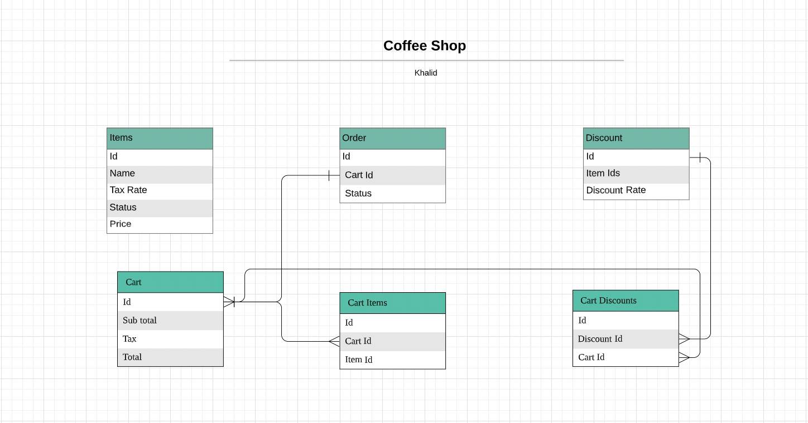

# README

This README would normally document whatever steps are necessary to get the
application up and running.

Things you may want to cover:

* Ruby version

  2.7.4

* Rails Version
  
  6.1.7

* Database ERD

